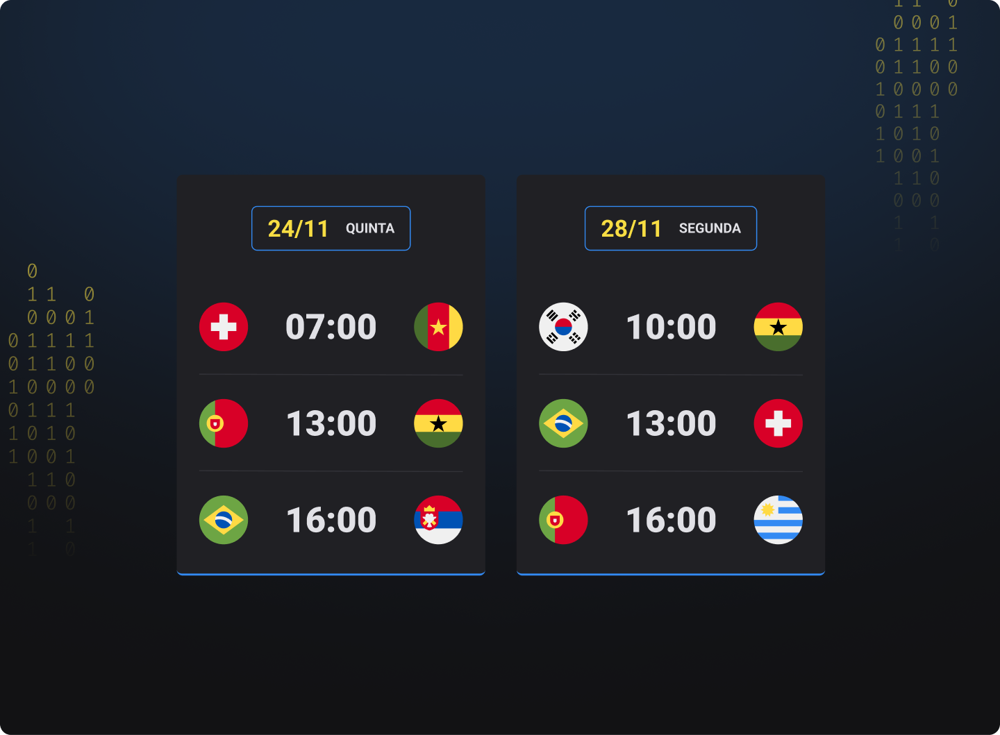

<h1 align="center"> Tabela de Jogos do Brasil na primeira fase da copa do mundo 2022 </h1>

Evento exclusivo e gratuito, promovido pela Rocketseat para ensino de tecnologias WEB.

  <a href="#-tecnologias">Tecnologias</a>&nbsp;nbsp;&nbsp;
  <a href="#-layout">Layout</a>&nbsp;&nbsp;&nbsp;|&nbsp;&nbsp;&nbsp;
  <a href="#memo-licença">Licença</a>

  

 

  

## 🚀 Tecnologias

Esse projeto foi desenvolvido com as seguintes tecnologias:

- HTML e CSS
- JavaScript
- Git e Github

##

## 🔖 Layout

Você pode visualizar o layout do projeto através [DESSE LINK](https://www.figma.com/file/P1QZejDKon3OlKuOkwPtuA/Calend%C3%A1rio-de-Jogos-(Community)?node-id=122%3A130). É necessário ter conta no [Figma](https://figma.com) para acessá-lo.

##

Esse projeto está sob a licença MIT.

---

powerd by kn9wer